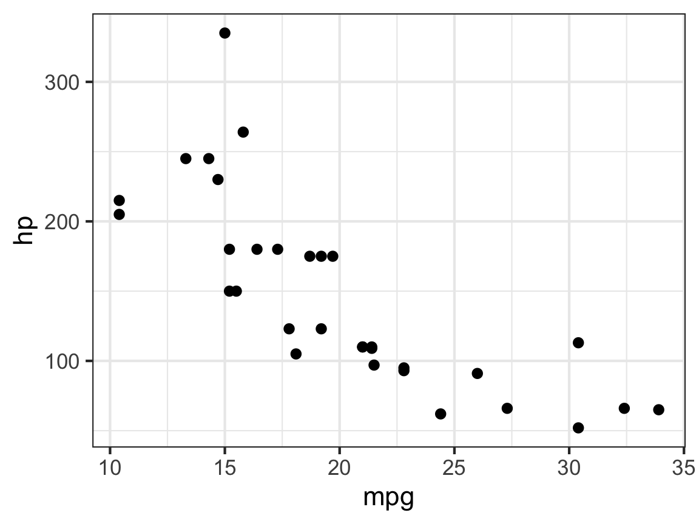

<!--
Title slide: just a normal lexis slide. Quarto's built-in `meta` shortcode
pulls values straight from the YAML front matter above, so there's nothing to
duplicate — edit the metadata and this slide updates. Drop/add lines for
whichever of subtitle/author/institute/date you're using; nothing here is
conditional.
-->






# 

## []{.fancy}

<br>

[]{.large}



---


---

# [Text styling]{.center}

::: {.col}
# Header level 1

## Header level 2

### Header level 3

#### Header level 4

##### Header level 5

###### Header level 6
:::

::: {.col}
Regular

_Italics_

**Bold**

***Bold italics***

~~Strikethrough~~

[Fancy text]{.fancy}

[external link](https://github.com/jhelvy/lexis)<br>

`Inline code`
:::

---



# [Inverse text styling]{.center}

::: {.col}
# Header level 1

## Header level 2

### Header level 3

#### Header level 4

##### Header level 5

###### Header level 6
:::

::: {.col}
Regular

_Italics_

**Bold**

***Bold italics***

~~Strikethrough~~

[Fancy text]{.fancy}

[external link](https://github.com/jhelvy/lexis)<br>

`Inline code`
:::

---

# [Colors!]{.center}

::: {.col}
Use this...

- `[text]{.red}`
- `[text]{.orange}`
- `[text]{.yellow}`
- `[text]{.green}`
- `[text]{.darkgreen}`
- `[text]{.blue}`
- `[text]{.darkblue}`
- `[text]{.purple}`
- `[text]{.black}`
:::

::: {.col}
...to get this

- **[text]{.red}**
- **[text]{.orange}**
- **[text]{.yellow}**
- **[text]{.green}**
- **[text]{.darkgreen}**
- **[text]{.blue}**
- **[text]{.darkblue}**
- **[text]{.purple}**
- **[text]{.black}**
:::

---

# Tables


::: {.cell}
::: {.cell-output-display}


|manufacturer |model | displ| year| cyl|trans      |drv | cty| hwy|fl |class   |
|:------------|:-----|-----:|----:|---:|:----------|:---|---:|---:|:--|:-------|
|audi         |a4    |   1.8| 1999|   4|auto(l5)   |f   |  18|  29|p  |compact |
|audi         |a4    |   1.8| 1999|   4|manual(m5) |f   |  21|  29|p  |compact |
|audi         |a4    |   2.0| 2008|   4|manual(m6) |f   |  20|  31|p  |compact |
|audi         |a4    |   2.0| 2008|   4|auto(av)   |f   |  21|  30|p  |compact |
|audi         |a4    |   2.8| 1999|   6|auto(l5)   |f   |  16|  26|p  |compact |
|audi         |a4    |   2.8| 1999|   6|manual(m5) |f   |  18|  26|p  |compact |


:::
:::


---

# Block quotes

Use the `>` to make block quotes:

```markdown
> This is what a block quote looks like.
```

> This is what a block quote looks like.

---

# Incremental content

Use `. . .` on its own line (xaringan's `--`) to reveal the rest of the slide on
the next click:

::: {.col}
```markdown
Everyone sees this first.

. . .

Then this appears.

. . .

And finally this.
```
:::

::: {.col}
Everyone sees this first.

. . .

Then this appears.

. . .

And finally this.
:::

---

# [Github code chunk highlighting]{.center}

::: {.col width="80%"}
::: {.font90}
```r
foo <- function(arg1 = 100, arg2 = "character string") {
  if (TRUE) {
    x = NULL  # if, function, NULL are keywords a
    for (i in 1:10) x = c(x, mean(3 * rnorm(100) + 1))
  }
}
```
:::
:::

---

# Line highlighting

Highlight lines with the `code-line-numbers` cell option:

::: {.col}
### Code

````{.markdown}
```{{r}}
#| code-line-numbers: "4,5"

library(ggplot2)

ggplot(mtcars) +
  aes(mpg, disp) +
  geom_point() +
  geom_smooth()
```
````
:::

::: {.col}
### Output


::: {.cell}

```{.r .cell-code  code-line-numbers="4,5"}
library(ggplot2)

ggplot(mtcars) +
  aes(mpg, disp) +
  geom_point() +
  geom_smooth()
```
:::

:::

---

# Sizing text and code

One system for everything: wrap any content in a `.fontNN` div to scale it to
NN% of the slide's base size (5% steps, `font10`–`font200`). It works the same
on paragraphs, lists, and code chunks — a chunk and its printed output always
match. For inline text there's also `[text]{.fontNN}` plus the `.small` and
`.large` shortcuts.

::: {.col}
Normal size:


::: {.cell}

```{.r .cell-code}
head(mtcars[, 1:4], 3)
```

::: {.cell-output .cell-output-stdout}

```
#>                mpg cyl disp  hp
#> Mazda RX4     21.0   6  160 110
#> Mazda RX4 Wag 21.0   6  160 110
#> Datsun 710    22.8   4  108  93
```


:::
:::

:::

::: {.col}
Wrapped in `::: {.font70}`:

::: {.font70}

::: {.cell}

```{.r .cell-code}
head(mtcars[, 1:4], 3)
```

::: {.cell-output .cell-output-stdout}

```
#>                mpg cyl disp  hp
#> Mazda RX4     21.0   6  160 110
#> Mazda RX4 Wag 21.0   6  160 110
#> Datsun 710    22.8   4  108  93
```


:::
:::

:::
:::

---





# Layouts!

---

# Tabset panels!

::: {.panel-tabset}

### R Code


::: {.cell}

```{.r .cell-code}
ggplot(mtcars, aes(x = mpg, y = hp)) +
  geom_point() +
  theme_bw() +
  labs(color = "Cylinders")
```
:::


### Plot


::: {.cell layout-align="center"}
::: {.cell-output-display}
{fig-align='center' width=50%}
:::
:::


:::

---

## [Three (or more) equal columns]{.center}

::: {.col}
`.col`, no `width`

Any number of `.col` divs in a row auto-splits the space evenly — no separate class for 2 vs 3 vs 4 columns.
:::

::: {.col}
`.col`, no `width`

Lorem ipsum dolor sit amet, consectetur adipiscing elit, sed do eiusmod tempor incididunt ut labore et dolore magna aliqua.
:::

::: {.col}
`.col`, no `width`

Lorem ipsum dolor sit amet, consectetur adipiscing elit, sed do eiusmod tempor incididunt ut labore et dolore magna aliqua.
:::

---

## [Two equal columns]{.center}

::: {.col}
`.col`

Two consecutive `.col` divs with no `width` split 50/50 automatically. No outer `::: {.columns}` wrapper needed either — just write the columns.
:::

::: {.col}
`.col`

Lorem ipsum dolor sit amet, consectetur adipiscing elit, sed do eiusmod tempor incididunt ut labore et dolore magna aliqua. Ut enim ad minim veniam, quis nostrud exercitation ullamco laboris nisi ut aliquip ex ea commodo consequat.
:::

---

## [Any split you want]{.center}

::: {.col width="65%"}
`.col width="65%"`

`width` takes any percentage — 65/35, 42/58, whatever the content needs. No fixed set of splits to remember.
:::

::: {.col width="35%"}
`.col width="35%"`

Only one side needs a `width`; a column left without one just takes whatever space remains.
:::

---

## [Uneven columns, custom gap \& alignment]{.center}

::: {.col width="50%" gap="3em" valign="middle"}
### `gap` and `valign`

Set `gap` or `valign` on any `.col` in the row and it applies to the whole row — handy here since this column's text is shorter than the code beside it, so `valign="middle"` centers them against each other.
:::

::: {.col width="25%" .font70}

```r
foo <- function(x) {
  x + 1
}
```
:::

::: {.col width="25%" .font70}

```r
bar <- function(y) {
  y * 2
}
```

:::

---





# [Full image background]{.fancy}{.white}

<br><br>

::: {.col width="70%"}

```r
{}
```

:::

---




# [[Full background color]{.white}]{.fancy}

<br><br><br>

::: {.col width="40%"}

```r
{}
```

:::

---





# Images!

---

# Images have no border by default

::: {.col width="60%"}
This code produces the image on the right:

```markdown

```
:::

::: {.col width="40%"}

:::

---

# Add a thin border with `.border`

::: {.col width="60%"}
This code produces the image on the right:

```markdown
::: {.border}

:::
```
:::

::: {.col width="40%"}
::: {.border}

:::
:::

---

## Or modify the border: `.borderthick`

::: {.col width="60%"}
This code produces the image on the right:

```markdown
::: {.borderthick}

:::
```
:::

::: {.col width="40%"}
::: {.borderthick}

:::
:::

---



## Or modify the border: `.whiteborder`

::: {.col width="60%"}
This code produces the image on the right:

```markdown
::: {.whiteborder}

:::
```
:::

::: {.col width="40%"}
::: {.whiteborder}

:::
:::

---



## Or modify the border: `.whiteborderthick`

::: {.col width="60%"}
This code produces the image on the right:

```markdown
::: {.whiteborderthick}

:::
```
:::

::: {.col width="40%"}
::: {.whiteborderthick}

:::
:::

---

# Make a polaroid image: `.polaroid`

::: {.col width="60%"}
This code produces the image on the right:

```markdown
::: {.polaroid}

:::
```
:::

::: {.col width="40%"}
::: {.polaroid}
{width="400"}
:::
:::

---

# Make a circle image: `.circle`

::: {.col width="60%"}
This code produces the image on the right:

```markdown
::: {.circle}

:::
```
:::

::: {.col width="40%"}
::: {.circle}
{width="400"}
:::
:::

---

# Make a thumbnail image: `.thumbnail`

::: {.col width="60%"}
This code produces the image on the right:

```markdown
::: {.thumbnail}

:::
```
:::

::: {.col width="40%"}
<br><br><br><br>

::: {.thumbnail}

:::
:::

---

# Image classes work on rendered charts too

::: {.col}
````markdown
::: {.border}

```{{r}}
ggplot(mtcars, aes(mpg, hp)) +
  geom_point()
```

:::
````

::: {.border}

::: {.cell layout-align="center"}
::: {.cell-output-display}
{fig-align='center' width=384}
:::
:::

:::
:::

::: {.col}
````markdown
::: {.circle}

```{{r}}
ggplot(mtcars, aes(mpg, hp)) +
  geom_point()
```

:::
````

::: {.circle}

::: {.cell layout-align="center"}
::: {.cell-output-display}
{fig-align='center' width=384}
:::
:::

:::
:::

---






# Thanks!

::: {.footer-large}
::: {.right}
[jhelvy.com `<svg aria-hidden="true" role="img" viewBox="0 0 640 512" style="height:1em;width:1.25em;vertical-align:-0.125em;margin-left:auto;margin-right:auto;font-size:inherit;fill:white;overflow:visible;position:relative;"><path d="M579.8 267.7c56.5-56.5 56.5-148 0-204.5c-50-50-128.8-56.5-186.3-15.4l-1.6 1.1c-14.4 10.3-17.7 30.3-7.4 44.6s30.3 17.7 44.6 7.4l1.6-1.1c32.1-22.9 76-19.3 103.8 8.6c31.5 31.5 31.5 82.5 0 114L422.3 334.8c-31.5 31.5-82.5 31.5-114 0c-27.9-27.9-31.5-71.8-8.6-103.8l1.1-1.6c10.3-14.4 6.9-34.4-7.4-44.6s-34.4-6.9-44.6 7.4l-1.1 1.6C206.5 251.2 213 330 263 380c56.5 56.5 148 56.5 204.5 0L579.8 267.7zM60.2 244.3c-56.5 56.5-56.5 148 0 204.5c50 50 128.8 56.5 186.3 15.4l1.6-1.1c14.4-10.3 17.7-30.3 7.4-44.6s-30.3-17.7-44.6-7.4l-1.6 1.1c-32.1 22.9-76 19.3-103.8-8.6C74 372 74 321 105.5 289.5L217.7 177.2c31.5-31.5 82.5-31.5 114 0c27.9 27.9 31.5 71.8 8.6 103.9l-1.1 1.6c-10.3 14.4-6.9 34.4 7.4 44.6s34.4 6.9 44.6-7.4l1.1-1.6C433.5 260.8 427 182 377 132c-56.5-56.5-148-56.5-204.5 0L60.2 244.3z"/></svg>`{=html}](https://www.jhelvy.com)<br>
[jph@gwu.edu `<svg aria-hidden="true" role="img" viewBox="0 0 512 512" style="height:1em;width:1em;vertical-align:-0.125em;margin-left:auto;margin-right:auto;font-size:inherit;fill:white;overflow:visible;position:relative;"><path d="M16.1 260.2c-22.6 12.9-20.5 47.3 3.6 57.3L160 376V479.3c0 18.1 14.6 32.7 32.7 32.7c9.7 0 18.9-4.3 25.1-11.8l62-74.3 123.9 51.6c18.9 7.9 40.8-4.5 43.9-24.7l64-416c1.9-12.1-3.4-24.3-13.5-31.2s-23.3-7.5-34-1.4l-448 256zm52.1 25.5L409.7 90.6 190.1 336l1.2 1L68.2 285.7zM403.3 425.4L236.7 355.9 450.8 116.6 403.3 425.4z"/></svg>`{=html}](mailto:jph@gwu.edu)<br>
[@jhelvy `<svg aria-hidden="true" role="img" viewBox="0 0 496 512" style="height:1em;width:0.97em;vertical-align:-0.125em;margin-left:auto;margin-right:auto;font-size:inherit;fill:white;overflow:visible;position:relative;"><path d="M165.9 397.4c0 2-2.3 3.6-5.2 3.6-3.3.3-5.6-1.3-5.6-3.6 0-2 2.3-3.6 5.2-3.6 3-.3 5.6 1.3 5.6 3.6zm-31.1-4.5c-.7 2 1.3 4.3 4.3 4.9 2.6 1 5.6 0 6.2-2s-1.3-4.3-4.3-5.2c-2.6-.7-5.5.3-6.2 2.3zm44.2-1.7c-2.9.7-4.9 2.6-4.6 4.9.3 2 2.9 3.3 5.9 2.6 2.9-.7 4.9-2.6 4.6-4.6-.3-1.9-3-3.2-5.9-2.9zM244.8 8C106.1 8 0 113.3 0 252c0 110.9 69.8 205.8 169.5 239.2 12.8 2.3 17.3-5.6 17.3-12.1 0-6.2-.3-40.4-.3-61.4 0 0-70 15-84.7-29.8 0 0-11.4-29.1-27.8-36.6 0 0-22.9-15.7 1.6-15.4 0 0 24.9 2 38.6 25.8 21.9 38.6 58.6 27.5 72.9 20.9 2.3-16 8.8-27.1 16-33.7-55.9-6.2-112.3-14.3-112.3-110.5 0-27.5 7.6-41.3 23.6-58.9-2.6-6.5-11.1-33.3 2.6-67.9 20.9-6.5 69 27 69 27 20-5.6 41.5-8.5 62.8-8.5s42.8 2.9 62.8 8.5c0 0 48.1-33.6 69-27 13.7 34.7 5.2 61.4 2.6 67.9 16 17.7 25.8 31.5 25.8 58.9 0 96.5-58.9 104.2-114.8 110.5 9.2 7.9 17 22.9 17 46.4 0 33.7-.3 75.4-.3 83.6 0 6.5 4.6 14.4 17.3 12.1C428.2 457.8 496 362.9 496 252 496 113.3 383.5 8 244.8 8zM97.2 352.9c-1.3 1-1 3.3.7 5.2 1.6 1.6 3.9 2.3 5.2 1 1.3-1 1-3.3-.7-5.2-1.6-1.6-3.9-2.3-5.2-1zm-10.8-8.1c-.7 1.3.3 2.9 2.3 3.9 1.6 1 3.6.7 4.3-.7.7-1.3-.3-2.9-2.3-3.9-2-.6-3.6-.3-4.3.7zm32.4 35.6c-1.6 1.3-1 4.3 1.3 6.2 2.3 2.3 5.2 2.6 6.5 1 1.3-1.3.7-4.3-1.3-6.2-2.2-2.3-5.2-2.6-6.5-1zm-11.4-14.7c-1.6 1-1.6 3.6 0 5.9 1.6 2.3 4.3 3.3 5.6 2.3 1.6-1.3 1.6-3.9 0-6.2-1.4-2.3-4-3.3-5.6-2z"/></svg>`{=html}](http://github.com/jhelvy)
:::
:::

